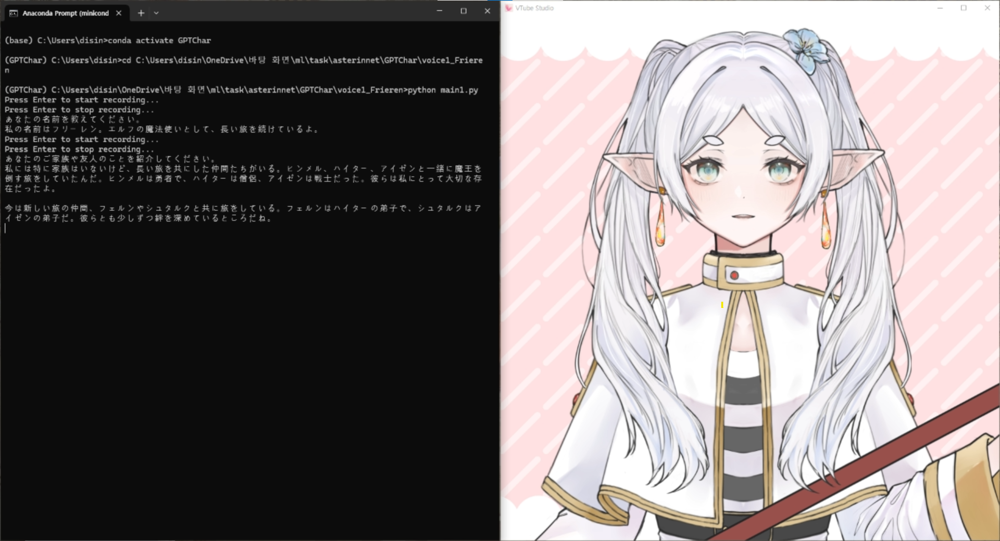
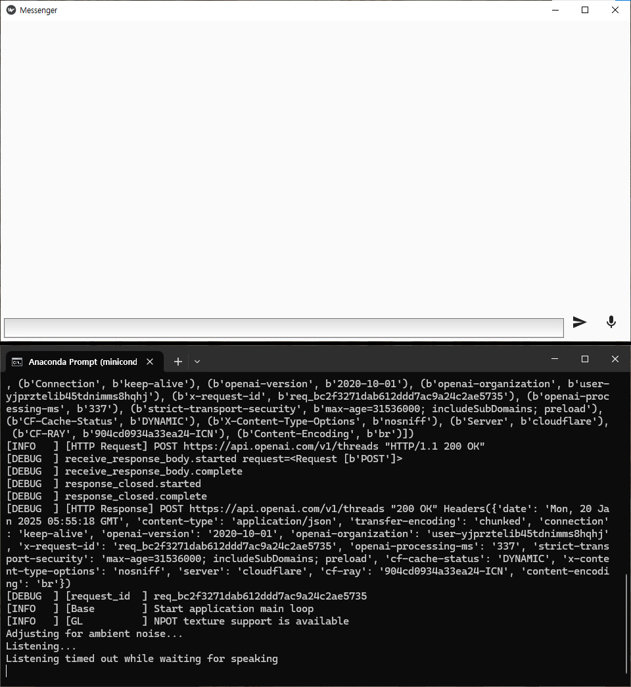

# GPT-Elevenlabs-Character

A text- and voice-interactable character that embodies a fictional character's personality and voice, created using ChatGPT Assistants feature and ElevenLabs fine-tuned TTS

figure1: Conversation example with VTube studio and VB-Cable

figure2: Messenger app example by KivyMD

## References:

https://sesang06.tistory.com/216

https://www.youtube.com/watch?v=oB8C4FcZDD0

https://github.com/rokbenko/ai-playground/blob/main/openai-tutorials/2-Build_personal_math_tutor/personal_math_tutor.py
